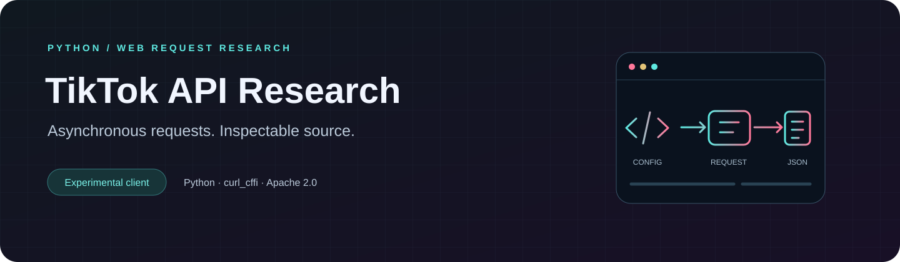

<p align="center">
  
</p>

<p align="center">
  <strong>A small Python research project for understanding web request construction.</strong><br>
  Asynchronous networking · Comment-response inspection · Signature experiments
</p>

<p align="center">
  <a href="#quick-start">Quick start</a> · <a href="#source-map">Source map</a> ·
  <a href="#current-scope">Current scope</a> · <a href="LICENSE">Apache 2.0 license</a>
</p>

## Overview

An experimental TikTok comment-request client built with Python and `curl_cffi`. Session initialization, request parameters, response handling and signature experiments are organized into four readable source files.

The included entry point requests the first page of comments for one configured video and prints JSON to the terminal. There is no desktop interface or packaged release.

## At a glance

| Area | What is in the source |
| --- | --- |
| Networking | An asynchronous `curl_cffi.requests.AsyncSession` |
| Session handling | Cookie/header/HTML token extraction and server-clock offset handling |
| Request construction | Video ID, comment count, cursor and configured request headers |
| Signature experiments | Python routines named `X-Bogus` and `X-Gnarly` |
| Response handling | JSON output, or an error object when the server returns HTML |

## Quick start

Use a local Python 3 environment. The repository does not include a dependency lockfile or a tested-version matrix.

```bash
git clone https://github.com/EhosanurRahmanRomi/TikTok-V5-API-Scraper--DD.git
cd TikTok-V5-API-Scraper--DD
python -m venv .venv
```

Activate the environment:

| Platform | Command |
| --- | --- |
| Windows PowerShell | `.\.venv\Scripts\Activate.ps1` |
| macOS / Linux | `source .venv/bin/activate` |

```bash
python -m pip install curl-cffi
```

Review [config.py](config.py) before running. Set `TARGET_VIDEO_ID` to the video you are authorized to inspect. Review `BASE_URL`, `USER_AGENT` and `IMPERSONATE_LABEL` for request configuration. An empty `PROXY_URL` uses a direct connection. Keep credentials and session data private.

```bash
python crawler.py
```

The response appears in the terminal. The current program does **not** create `result.json` automatically.

## Source map

| File | Responsibility |
| --- | --- |
| [crawler.py](crawler.py) | Session initialization, one comment request and terminal output |
| [algorithms.py](algorithms.py) | Signature-generation experiments |
| [utils.py](utils.py) | Device ID generation and token extraction helpers |
| [config.py](config.py) | Endpoint, target video and request/signing configuration |

```text
Configuration → Session initialization → Comment request → Terminal JSON
                      ↑                       ↑
                Token helpers          Signature experiments
```

## Current scope

- The default request uses `count=20` and `cursor=0`. Pagination and bulk collection are not implemented.
- The entry point performs one workflow. An asynchronous session does not establish a measured concurrency or performance guarantee.
- Current endpoint and signature compatibility have not been verified for this showcase update. The `X-Gnarly` routine is hash-derived; no validation tests establish compatibility with TikTok's current implementation.
- An HTML response returns an error object. There is no interactive CAPTCHA solver.
- The repository has no automated test suite or reproducible successful-response fixture.

## Research and contributions

Use the project for authorized educational research and follow the service's terms and applicable rules. It is an independent project with no TikTok affiliation.

[Report an issue](https://github.com/EhosanurRahmanRomi/TikTok-V5-API-Scraper--DD/issues) with dependency versions, reproduction steps and a redacted response. Exclude cookies, tokens, credentials and private account details.

## License

The repository's [LICENSE](LICENSE) is **Apache License 2.0**.

---

Maintained by [Ehosanur Rahman Romi](https://github.com/EhosanurRahmanRomi).
